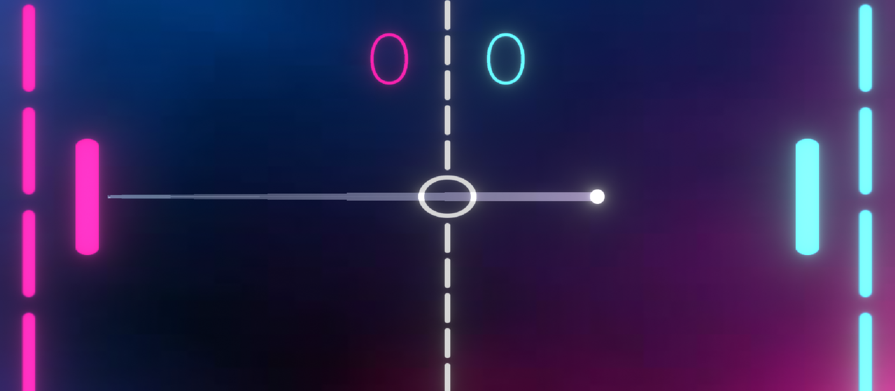

# PONG

## Amir Colbert

Hello! My name is Amir Colbert and I am an aspiring AR/VR Software engineer! I love video gmaes and I have a passion for creating them. Some of my favorite games include Minecraft, Dead Cells, and DOOM Slayer! I have been studying C# at ATLAS School in Tulsa Oklahoma and have really honed in my skills with the Unity software, I really enjoy it!

### Description

This repository has two renditions of a classic, pong. The first rendition was building pong from scratch. Really understanding what tweening means in Unity and how to use it played a vital role in creating this game the firt time. The second rendition (as featured in the screenshot above) was taking what we learned from creating the first version and improving upon it. In this version I added a pop of color. I also added a bloom effect to the screen to make everything glow, and finished it off with a line rendered from the ball!

### Links

Please feel free to reach out to me via LinkedIn!

[LinkedIn](https://www.linkedin.com/in/colbertamir/)